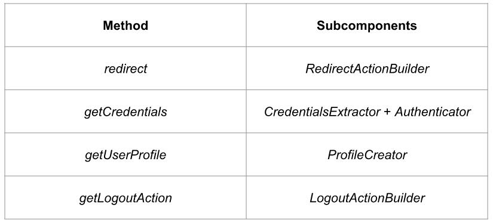

# 1、什么是PAC4J？
* 一个《security library》=一个组件集合保护一个java的WEB应用（认证+授权）

# 2、什么是PAC4J？
* 一个安全引擎（github.com/pac4j/pac4j):
* →pac4j-core 模块（核心组件）
* →pac4j-* 模块（认证机制)  
&emsp;&emsp;&emsp;&emsp;&emsp;`+`
* 很多可以选择的实现框架
* →  `*`-pac4j 库   
  
# 3、为什么选择pac4j？
* “一个安全库”=一个安全模块解决了所有的认证授权的框架

# 4、例子：选择了合适的pac4j库
* 我有一个Play2.0的web应用我想通过Facebook登录：
* →1.我们需要使用play-pac4j library(同时pulls pac4j-core模块）在PLAY应用中用于基本
  的安全支持
* →1.我们同时依赖pac4j-oauth用于支持登录Facebook的OAuth 协议

# 5、可用的pac4j的实现
[http://www.pac4j.org/implementations.html](http://www.pac4j.org/implementations.html)  

  
# 6、认证
客户端=用于WEB认证机制的流程
* →2个使用要点
>>1）restful认证方式（和服务器之间的完整流程，一个必须的回调端点，在每一次登陆完成后，有状态）
>>2）WEB服务的直接认证客户端（凭证通过 或者 在每一次HTTP请求，无状态）

# 7、用户“概要”（UserProfil）
*  在客户端的成功认证后，被认证的用户将会被保存在一个用户概要的主体类中（subclass of UserProfile）
（例如 FacebookProfile,CasProfile...）

* UserProfil可以在session中获取（间接客户端）或者在当前的HTTP请求中（直接的客户端）

* UserProfil是一个用户的标志，属性，角色，和权限等等。。。

# 8、授权
* 一个授权人=一个授权机制
* 授权发条件：
>→一个被认证的用户“概要”（例如：该用户是否拥有合法的角色？）  
>→是否在当前HTTP请求（例如：是不是一个合法的跨域请求？）  

# 9、配置
* 客户端=拥有一个相同的回调URL的客户端分组
* 配置=一个安全的客户端配置、一个安全的授权配置

# 10、WEB安全组件
* 每一个pac4j的具体的实现库
* 基本的，3个安全组件：
>1)"安全拦截器"：用于保护URL  
>2)"回调 controller"：一个用于间接客户端的回调操作  
>3)"注销 controller":用于执行注销

# 11、安全拦截器1
* 安全拦截器基于客户端，认证器，匹配器配置：
>1)基于被配置的客户端：
>>a)用于用户登陆的直接客户端；  
>>b)如果用户一直没有被认证以及一个用于间接认证的客户端，它将用户重定向至有关的身份认证服务器；  
>>c)其他的，返回401状态值error（“unauthorized”）

# 12、安全拦截器2
* 如果用户被认证了：
>2)基于被认证的用户：
>>a）将会检查被认证的用户访问被保护的URL资源  
>>b)其他的，返回403状态值error（“forbidden”）

# 13、回调controller
* 只能用户间接的客户端：
>1)将会从身份认证服务器收到一个回调命令（包含了一些凭证“credentials”）  
>2)完成了登陆程序  
>3)用于保存被认证的用户"概要"在web session中  
>4)保存了最初的被请求的URL（该URL被安全过滤器保护）

# 14、例子：保护一个在PLAY2.0中的URL（play-pac4j）

# 15、一个Facebook的web登陆流程（间接的客户端）
* 1）用户访问 /facebook/index.html URL
* 2) 安全拦截器的作用：当这个用户没有被认证，用户将会被重定向到Facebook登陆页面
* 3）成功的在Facebook成功的登陆
* 4）用户将会被重定向至该应用“/callback”的URL(包含了用户凭证以参数client_name=FacebookClient)
* 5）登陆流程完成，该用户“概要”被保存在了session，以及该用户被重定向了最初的请求URL:/facebook/index.html
* 6）“安全拦截器”再次产生作用：用户被认证，权限将会被检查以及，该用户就会被允许访问URL（其余情况403 错误）

# 16、例子：Spring Security 保护一个URL（spring-security-pac4j）1/3

# 17、例子：Spring Security 保护一个URL（spring-security-pac4j）2/3

# 18、例子：Spring Security 保护一个URL（spring-security-pac4j）3/3

# 19、检索用户“概要”
* 当前用户“概要”可以通过以下检索：
* →一个可以代表请求/响应的WebContext（每一个pac4j的具体实现库）
* →ProfileManger

# 20、例子：在J2E的环境中取得用户“概要”

# 21、客户端的主要组件
* 客户端所有的方法被授予主要组件：
  

# 22、凭证核实
* Authenticator组件（在客户端内部）用于执行凭证核实
* 通常情况下，他将创建一个用户“概要”以及保存当前用户凭证

# 23、已经实现的客户端
* [http://www.pac4j.org/docs/clients.html](http://www.pac4j.org/docs/clients.html)    

# 24、已实现的认证器
* [http://www.pac4j.org/docs/authenticators.html](http://www.pac4j.org/docs/authenticators.html)    
* 

# 25、http客户端
* 所有的客户端都有一个内部默认的认证器器校验凭证（基于协议的实现）
* 除了http客户端：
>→它只晓得怎么去获得凭证（例如：HeaderClient用于找去header，ParameterClient用于回收请求参数），其余情况则需要明确的去定义一个认证器去验证凭证

# 26、例子：基于在j2e环境的outh+JWT （j2e-pac4j）1/2

# 27、例子：基于在j2e环境的outh+JWT （j2e-pac4j）2/2

# 28、JWT token的登陆流程或者基本的认证（直接客户端）
* 1）一个WEB应用访问“/rest/operation”URL
* 2)"安全拦截器"产生作用：作用于每一个直接客户端（basic auth+JWT token）,"安全拦截器"将会试着去除凭证并验证凭证
* 3）如果该用户被成功认证，授权通过，如果该用户  
如果没有被认证，401 错误返回；

# 29、ProfileCreator
* ProfileCreator是默认用于创建用户“概要”的类，所有的客户端都被同时和AuthenticatorProfileCreator（负责存储用户的凭证）一起定义
* 现在，你可以创建属于你自己的ProfileCreator以及返回一个新的用户“概要”（一个被创建和通过验证的凭证）

# 30、ProfileService
* ProfileService是Authenticator的扩展
>→验证凭证
>→对用户进行增删改查

# 31、Authorizers
[http://www.pac4j.org/docs/authorizers.html](http://www.pac4j.org/docs/authorizers.html)
* 大多数的Authorizers在PAC4J-core模块中例如：
>RequireAnyRoleAuthorzer  
>RequireAnyRoleAuthorzer  
>RequireAnyRoleAuthorzer  
>CorsAuthorzer  
>CsrfAuthorizer  
>等等。。。
* 大多数的Authorizers可默认的获取例如：
>noframe  
>csrf...

# 32、更多1/3
*
# 33、更多2/3  

# 34、更多3/3
